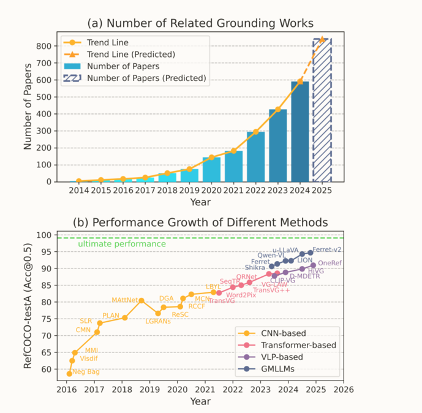
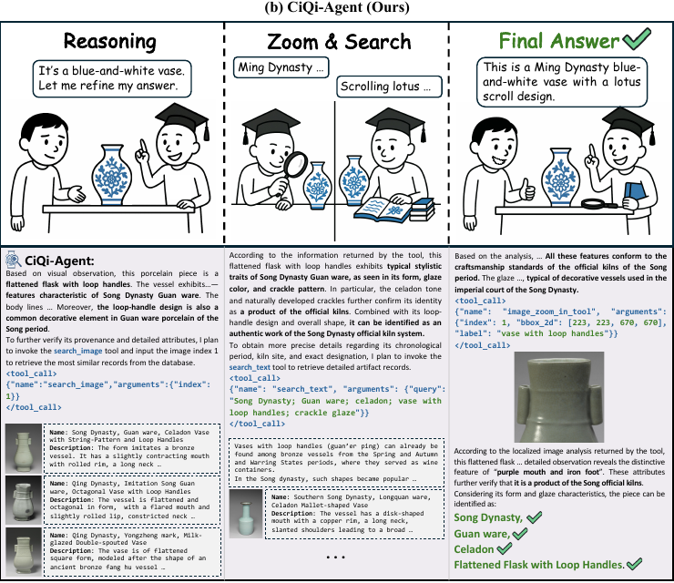
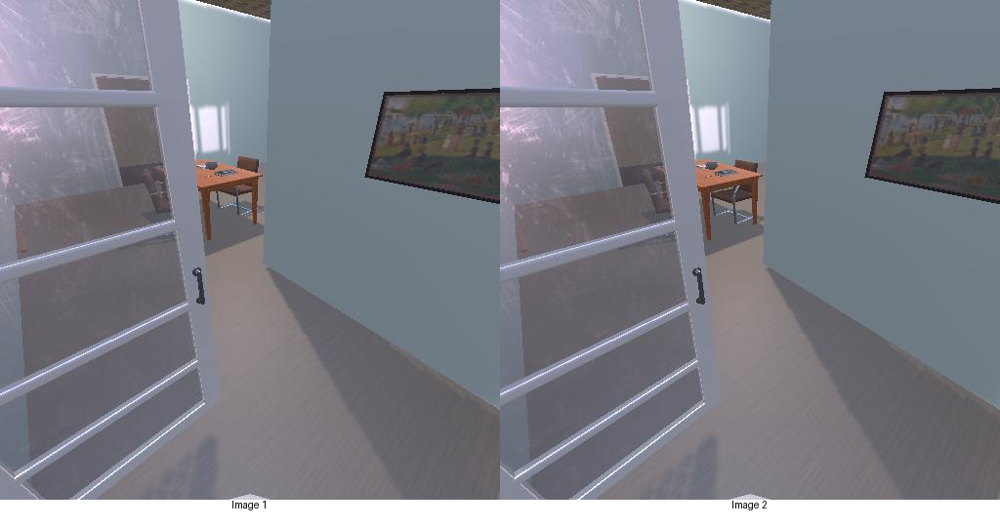
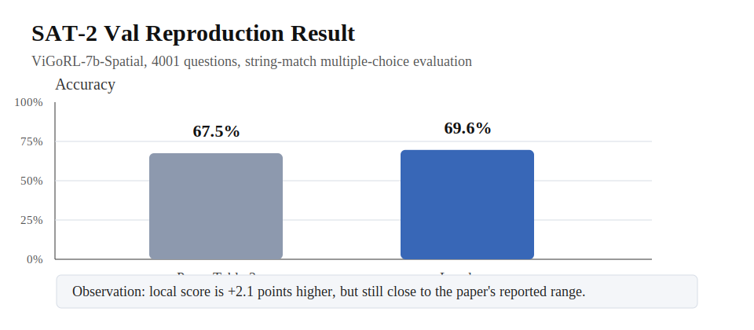
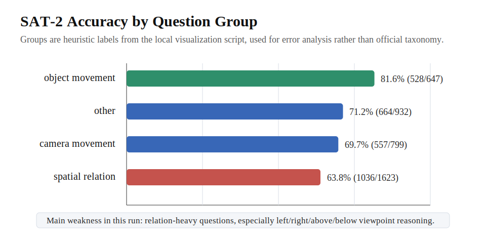
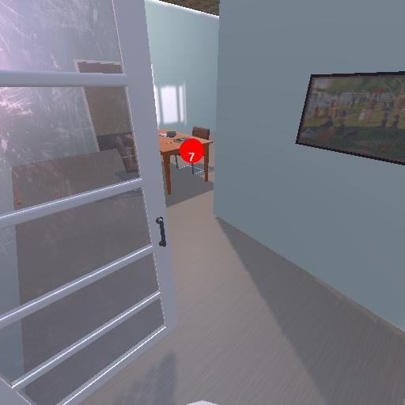
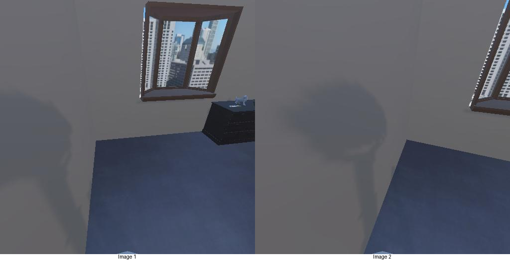

# 研究方向确认与可行性分析
> 04.21 - 05.11 组会汇报
>
> 汇报人：黄佩文
>
> 主题：2D Visual Grounding 探索 / Cultural 论文阅读 / VLM 探索

---

## 目录

1. **近三周探索主线**
2. **2D visual grounding 的探索与判断**
3. **Cultural 方向的论文阅读与机会**
4. **VLM 探索与复现进展**
5. **最终方向确认**

---

## 近三周探索主线

- 阅读 **Grounding DINO / GroundingME / Survey**
- 目标：判断纯 2D grounding 是否仍值得作为主方向
- 判断：方法成熟，真实 gap 转向 reject / complex reasoning / video grounding

- 阅读 **Cultural heritage / cultural knowledge / cultural understanding** 相关论文
- 目标：把 cultural 从“应用场景”转成可研究问题
- 判断：仅做文化问答不够，需要引入 visual evidence 与 grounded visual reasoning

- 阅读 **Magma / VGR / Grounded RL / CiQi-Agent**
- 复现 **Grounded RL for Visual Reasoning**
- 判断：选定 **multimodal + grounded visual agent + cultural**
- 方法关键词：VLM + reasoning + agent + tool + RL

这三周的核心问题是：<strong>在符合实验室方向的基础上，找到一个自己真正感兴趣、同时具备发展前景的研究切入点。</strong>

来源：上传的两份 Word 周报中“黄佩文”条目

---

## 我用什么标准来判断方向

### 对我更重要的四个标准

- **与实验室契合**：multimodal / cultural / agent
- **研究空间足够大**：不局限于单一 benchmark 的小幅增量
- **可行性足够高**：有 baseline、可复现、可验证
- **应用价值明确**：最好能落到真实 cultural 场景

### 这三条线的初始假设

| 方向 | 直觉优势 | 潜在风险 |
|---|---|---|
| 2D grounding | 问题清晰、资源成熟 | benchmark 饱和 |
| Cultural | 应用价值强、空白更多 | 数据和评测门槛高 |
| VLM / agent | 上游能力强、方法前沿 | 范围太大，容易发散 |

---

<!-- _class: part1-slide -->
## Part I：2D visual grounding 探索

### 阅读路径

1. **Grounding DINO**
   - close-set 扩展到 **open-set + referring expressions**
   - early fusion 被证明更适合 grounding
2. **GroundingME**
   - 一个更难的 benchmark，尤其暴露 **rejection** 缺口
3. **Survey**
   - 判断 benchmark、multi-image、video grounding 的真实瓶颈

### 我得到的判断

- 2D grounding 的方法论已经很成熟
- 经典 benchmark 上性能已经非常高
- 在极难例子上，大模型也已经能做很细粒度的区分
- 真正的 gap 更偏向：
  - 拒答能力
  - 复杂关系
  - 更真实场景

<a href="https://arxiv.org/abs/2303.05499">Grounding DINO: Marrying DINO with Grounded Pre-Training for Open-Set Object Detection</a> 
<a href="https://arxiv.org/abs/2512.17495">GroundingME: Exposing the Visual Grounding Gap in MLLMs through Multi-Dimensional Evaluation</a> 
<a href="https://arxiv.org/abs/2412.20206">Towards Visual Grounding: A Survey</a>

---

## 2D grounding：为什么我没有把它定为主方向

支持它的理由

- 任务定义清楚，论文脉络完整
- baseline 丰富，复现门槛不高
- 与多模态、视觉理解天然相关
- 适合作为后续 reasoning / agent 的基础能力

让我犹豫的地方

- **经典 benchmark 接近饱和**
- 人眼都很难分辨的 coin / airplane 难例，模型也已有很强表现
- 新 benchmark 的改进更偏“补洞”而非“开新题”
- 如果只做纯 2D REC，创新空间有限
- 更像基础组件，而不是我想长期投入的中心问题

结论：<strong>不选择“纯 2D grounding 刷 benchmark”作为主方向</strong>，但保留 grounding 作为后续 cultural reasoning 与 VLM agent 的关键能力。

<a href="https://arxiv.org/abs/2512.17495">GroundingME: best model only reaches 45.1%, while rejection remains a major gap</a> 
<a href="https://arxiv.org/abs/2412.20206">Towards Visual Grounding: benchmark saturation and future challenges</a>

---

## Part II：Cultural

### 代表阅读

- **Towards Cross-Modal Retrieval in Chinese Cultural Heritage Documents**
  - 文化遗产图文检索数据集
- **Grounding Multilingual Multimodal LLMs With Cultural Knowledge**
  - 多语言文化知识 grounding

### 判断

- 已有 retrieval / knowledge / understanding 基础
- 缺少 **区域级视觉证据**
- 需要把文化知识绑定到图像区域

### 代表阅读

- **Benchmarking Vision Language Models for Cultural Understanding**
  - 系统评测 VLM cultural understanding
  - 暴露文化语境与地域差异问题

### 启发

- cultural = 视觉 + 语言 + 背景知识
- 文本答案容易受先验误导
- grounding 让 reasoning 可验证

Towards Cross-Modal Retrieval in Chinese Cultural Heritage Documents: Dataset and Solution 
Grounding Multilingual Multimodal LLMs With Cultural Knowledge 
Benchmarking Vision Language Models for Cultural Understanding

---

## Cultural 文献地图：有什么，缺什么

### 已经看到的资源基础

- **Chinese Cultural Heritage Documents**
  - cross-modal retrieval 数据基础
- **Cultural Knowledge / Understanding**
  - knowledge grounding / CVQA / understanding benchmark
- **Cultural Alignment**
  - value sensitivity / multi-agent debate

### 仍然没有被充分解决的缺口

- 多数任务更偏 **retrieval / VQA / knowledge**
- 很少要求模型指出“答案来自图像哪里”
- 缺少 **文化知识 + 视觉证据** 的联合评测

判断：<strong>不是直接做文化问答，而是寻找 grounded reasoning 切口。</strong>

Towards Cross-Modal Retrieval in Chinese Cultural Heritage Documents: Dataset and Solution 
Grounding Multilingual Multimodal LLMs With Cultural Knowledge 
Benchmarking Vision Language Models for Cultural Understanding; CVQA

---

## Cultural 方向的可行性分析

为什么值得做

- 与实验室 **multimodal + cultural + agent** 很契合
- 研究问题不只是分类，而是 **reasoning + evidence**
- 相比通用 benchmark，更容易提出有场景感的任务
- 可以把 grounding 从“定位任务”转成“推理证据”

主要挑战

- 数据构建和评测标准成本更高
- 需要处理专家知识与文化代表性问题
- 只做应用层封装会显得 novelty 不够

判断：<strong>Cultural 不单独作为领域任务，而作为 grounded reasoning / tool-use VLM 的落地场景。</strong>

---

## Part III：VLM 探索带来的新判断

### 代表阅读

- **Magma**
  - multimodal agent；action grounding / planning
  - model 和 code 公开，适合复现
- **CiQi-Agent**
  - 陶瓷鉴赏场景中的 VLM agent
  - visual tools + cultural reasoning
- **VGR**
  - 先定位关键区域，再推理
  - 对抗 language bias
- **Grounded RL for Visual Reasoning**
  - 用 RL 学习 region-level grounding thought

### 共通趋势

- 从 **answer-only** 走向 **reasoning with evidence**
- 从 **语言链式思考** 走向 **视觉区域级思考**
- 从单纯理解走向 **agent / tool / action**

吸引点：<strong>有方法创新空间，也能自然落到 cultural 场景。</strong>

<a href="https://huggingface.co/papers/2502.13130">Magma: A Foundation Model for Multimodal AI Agents</a> 
<a href="https://arxiv.org/abs/2603.28474">CiQi-Agent: Aligning Vision, Tools and Aesthetics in Multimodal Agent for Cultural Reasoning on Chinese Porcelains</a> 
<a href="https://huggingface.co/papers/2506.11991">VGR: Visual Grounded Reasoning</a> 
<a href="https://arxiv.org/abs/2505.23678">Grounded Reinforcement Learning for Visual Reasoning</a>

---

## 为什么关注 CiQi-Agent

研究课题

- 面向中国古陶瓷鉴赏的 multimodal agent
- 将 **视觉分析、工具调用、审美知识** 放到同一流程
- 任务不是简单问答，而是围绕器型、纹样、釉色、年代做推理
- 与“文化场景中的可解释视觉推理”很接近

因此我把 CiQi-Agent 作为<strong>方向参照</strong>，实际先选择开源且可复现的 Grounded RL / ViGoRL 验证技术可行性。

---

## 实验复现：Grounded RL / ViGoRL

为什么先复现这篇

- 论文目标正好对应 **visual reasoning + grounded reasoning**
- 公开了模型权重、代码和评测脚本
- 输出不是只看最终答案，还鼓励模型在 reasoning 中引用坐标
- 适合作为后续“答案 + 视觉证据”的技术 baseline

本次复现对象

- 模型：**ViGoRL-7b 系列 7B checkpoint**
- Benchmark：**SAT-2 visual reasoning**
- 本地数据文件：`sat2_test.jsonl`
- 样本数：**4001**
- 输出格式：`<think>...</think><answer>...</answer>`

复现目的不是单纯刷分，而是确认：<strong>这种 grounded reasoning 路线能否在本地机器上稳定跑通，并产生可分析的中间结果。</strong>

<a href="https://ar5iv.labs.arxiv.org/html/2505.23678">Grounded RL paper: SAT-2 validation and Table 2</a> 
<a href="https://visually-grounded-rl.github.io/">Project page</a>; <a href="https://huggingface.co/papers/2505.23678">HF paper page</a>

---

<!-- _class: sat2-slide -->
## SAT-2 Benchmark：它到底在测什么

### 数据形式

- 输入是一张图像，或两帧拼接后的图像
- 问题通常围绕：
  - 相机是否移动、怎么移动
  - 物体是否被移动、往哪个方向移动
  - 当前视角下的左右、前后、远近关系
- 答案是多选题选项文本，评测时做 string match

### 为什么适合这个阶段

- 它不只是问“图里有什么”
- 它要求模型比较视角、物体关系和空间变化
- 与后续 indoor / museum navigation 任务很接近

示例：前后帧拼接图，用于判断物体或相机变化。

---

## 本地实验设置：真实跑通的条件

运行配置

- GPU：单张 **RTX 4090 24G**
- 推理后端：**vLLM**
- 并行：`NUM_PROCESSES=10`
- rollout：每题 `N_ROLLOUTS=1`
- 生成：`MAX_NEW_TOKENS=2048`
- judge：`string_match`

为了跑通做的限制

- `--max-model-len 8192`
- `max_pixels=1587600`
- `gpu-memory-utilization=0.95`
- 清理其他占用显存的进程后再跑
- 全程约 **43-44 分钟**，最终 exit code 为 0

结果已保存到本地 rollout 目录与日志文件中，便于后续做误例回看与结果汇总。

---

<!-- _class: result-slide -->
## 复现结果：与论文是否一致

### 论文结果

- 论文 Table 2：**ViGoRL-7b on SAT-2 Val**
- 报告结果：**67.5% ± 1.5**
- 评测方式：multiple-choice answer matching

### 本地结果

69.6%

- 正确：**2785**
- 总数：**4001**
- 错误：**1216**
- 与论文差值：约 **+2.1 points**

判断：<strong>本地结果与论文基本一致，略高一点。</strong>考虑论文的方差范围和本地评测配置差异，这个复现结果是可信的。

备注：脚本中的 `MODEL_TAG` 仍含 3B 字样，但实际加载的是 7B checkpoint。

---

## 可视化分析：哪里强，哪里弱

### 从本地 dashboard 看到的现象

- **object movement** 最稳定：81.6%
- **camera movement** 接近总体水平：69.7%
- **relation reasoning** 最弱：63.8%
- worker 之间存在轻微波动：
  - 最高 worker：74.6%
  - 最低 worker：67.1%
- 说明错误主要不是系统崩溃，而是空间关系判断本身更难

本地可视化：`data/rollouts/.../visualization/index.html`；统计由 `scripts/visualize_rollouts.py` 生成。

---

## 样例观察：正确与错误都很有信息量

<strong>正确例：object movement</strong>

GT / Pred：Chair was moved left and towards the camera in the first frame

这个例子说明模型能处理两帧拼接图中的物体位移。

<strong>错误例：relation reasoning</strong>

问题：turn left 40 degrees 后是否 facing away from Chair

GT：yes；Pred：no

这类题需要把当前视角转换成转向后的新视角。

<strong>错误例：camera movement</strong>

GT：rotated left；Pred：did not move

模型有时会把小幅视角变化误判为静止。

对我最有用的不是单个 accuracy，而是这些错例提示：后续如果做室内/博物馆任务，需要更强的视角变换、左右关系和微小运动判断能力。

---

## 最终方向确认

### 我最后不想做的

- 只做纯 2D grounding benchmark
- 只做 cultural 分类 / 问答应用
- 直接跳到过大的通用 multimodal agent

### 我想做的组合

- **方法主线**：VLM + reasoning + agent + tool + RL
- **任务形态**：任务导向 grounded visual reasoning
- **核心场景**：视觉理解与交互
- **落地验证**：博物馆导览 / cultural heritage / connoisseurship
- **核心目标**：答得对、找得到、能解释、可执行

方向表述：<strong> grounded visual reasoning，研究带视觉证据的 VLM reasoning / agent；博物馆与文化遗产作为落地场景。</strong>

---

## 一个更具体的研究切口

### 初步研究假设

- 博物馆文化图像场景中，仅输出文本答案不够可靠
- 如果要求模型同步输出 **region grounding / segmentation evidence / action evidence**
  - 可以减少语言偏置
  - 可以增强可解释性
  - 可以支持 tool-use / RL / agent planning

### 一个可操作的任务定义

1. 输入：场景图像 + 问题 / 任务指令
2. 输出：答案 / 行动建议 + 区域证据
3. 增强：visual tool / retrieval / grounded CoT / RL

<a href="https://aclanthology.org/2025.emnlp-main.1131/">Seeing Culture: answer + segmentation evidence</a> 
<a href="https://arxiv.org/abs/2505.23678">Grounded RL for Visual Reasoning: grounded thought as key cognitive behavior</a>

---

## 下一步计划

短期

- 继续完善 **Grounded RL / VGR** 复现理解
- 梳理 indoor grounded reasoning 与 cultural benchmark 的可用数据源
- 明确“答案 + grounding evidence”的评测方式

中期

- 搭建一个普通图像 / 博物馆场景的 pilot task
- 先做 answer-only baseline
- 再加入 grounding / tool-use / RL 变体比较

现阶段的核心不是急着做大系统，而是先把 <strong>任务定义、评测方式、baseline 路线</strong> 三件事确定下来。

---

## 总结

1. **2D grounding 很强，但不适合作为我当前的主方向。**
2. **Cultural 场景给了我一个更有价值的落地问题。**
3. **VLM 的 grounded reasoning / tool-use 提供了方法创新空间。**
4. **因此我最终选择：面向图像的 grounded visual reasoning，做带视觉证据的 VLM reasoning / agent；cultural 作为重点落地场景。**

<!-- 

最终目标不是再把模型“说得更像”，而是让它在真实空间任务里真正做到：<strong>看得见、指得准、讲得清、能行动。</strong>

 -->
